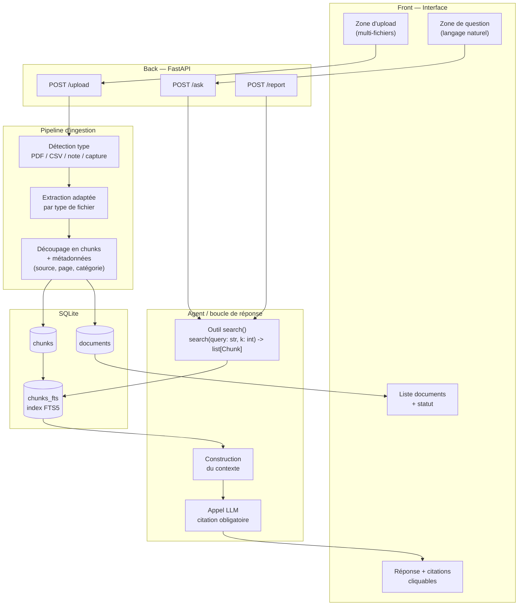

# Architecture — Multivers.log

## Vue d'ensemble

Multivers.log ingère des documents hétérogènes issus de plusieurs univers thématiques (archéologie, espace, JDR, jeu vidéo), en extrait une structure exploitable, et répond à des questions en langage naturel avec citation systématique de la source exacte.

## Schéma

## Description des couches

### Front
- Zone d'upload de documents (drag & drop, multi-fichiers)
- Zone de chat/questions en langage naturel
- Affichage des réponses avec citations cliquables
- Vue liste des documents avec statut (en cours / traité / erreur)

### Back (FastAPI)
- `POST /upload` : reçoit les fichiers, déclenche le pipeline d'ingestion
- `POST /ask` : reçoit une question, déclenche la boucle agent
- `POST /report` : génère une synthèse du corpus

### Pipeline d'ingestion
1. Détection du type de fichier (PDF, CSV, note texte, capture d'écran)
2. Extraction adaptée par type (texte, tableau, OCR si besoin)
3. Découpage en chunks avec métadonnées (document source, page/position, catégorie thématique : archéo / espace / JDR / jeu vidéo)
4. Écriture en base SQLite + indexation FTS5

### Agent / boucle de réponse
1. Réception de la question utilisateur
2. Appel de l'outil `search()` sur l'index FTS5
3. Construction du contexte à partir des chunks trouvés
4. Appel au LLM avec obligation de citer ses sources
5. Renvoi réponse + références cliquables vers les passages exacts

### Stockage (SQLite)
- `documents` : métadonnées des fichiers uploadés
- `chunks` : passages extraits, un document en a plusieurs
- `chunks_fts` : table virtuelle FTS5 pour la recherche plein texte

## Choix techniques justifiés

- **SQLite + FTS5 plutôt que base vectorielle** : pas de dépendance externe, pas d'appel API supplémentaire pour indexer, setup minimal. Compromis assumé : moins bon sur les questions reformulées différemment du texte source, acceptable pour un MVP de 3 jours avec un vocabulaire technique répétitif.
- **FastAPI** : rapide à mettre en place, écosystème Python cohérent avec le reste du pipeline d'extraction.